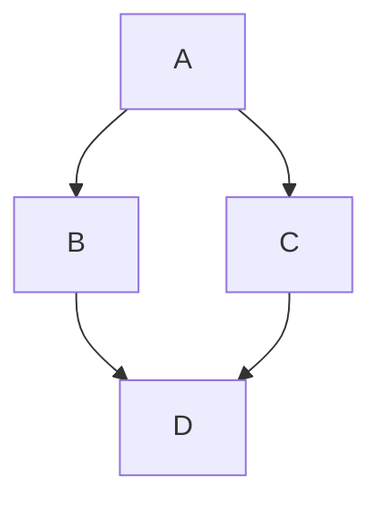

## 수식과 다이어그램

글을 쓰다 보면 수식과 다이어그램을 써야 하는 경우가 많다.

`GitHub/Jekyll` 조합을 통한 블로그는 마크다운 형식으로 글을 쓰는데, 수식과 다이어그램은 각각 다음의 조합을 통해 해결 가능하다.

내용 | 툴
--- | ---
수식 | `MathJax`
다이어그램 | `Mermaid`

### 셋업

이 둘을 따로 따로 셋업하는 방법이 있기는 하지만,
이 둘을 모두 해결해주는 Jekyll 플러그인이 있다.

[Jekyll Spaceship](https://github.com/jeffreytse/jekyll-spaceship)

* `Gemfile`에 다음 내용을 추가

```yaml
# If you have any plugins, put them here!
group :jekyll_plugins do
  gem 'jekyll-spaceship'
end
```

* `bash`에서 `bundle install`를 실행
* `_config.yml`파일을 열어서 `plugins:` 항목에 다음과 같이 추가

```yaml
plugins:
  - jekyll-spaceship
```

* `_config.yml`파일의 마지막 부분에 다음 내용 추가

```yaml
# Where things are
jekyll-spaceship:
  # default enabled processors
  processors:
    - table-processor
    - mathjax-processor
    - plantuml-processor
    - mermaid-processor
    - polyfill-processor
    - media-processor
    - emoji-processor
    - element-processor
  mathjax-processor:
    src:
      - https://polyfill.io/v3/polyfill.min.js?features=es6
      - https://cdn.jsdelivr.net/npm/mathjax@3/es5/tex-mml-chtml.js
    config:
      tex:
        inlineMath:
          - ['$','$']
          - ['\(','\)']
        displayMath:
          - ['$$','$$']
          - ['\[','\]']
      svg:
        fontCache: 'global'
    optimize: # optimization on building stage to check and add mathjax scripts
      enabled: true # value `false` for adding to all pages
      include: []   # include patterns for math expressions checking (regexp)
      exclude: []   # exclude patterns for math expressions checking (regexp)
  plantuml-processor:
    mode: default  # mode value 'pre-fetch' for fetching image at building stage
    css:
      class: plantuml
    syntax:
      code: 'plantuml!'
      custom: ['@startuml', '@enduml']
    src: http://www.plantuml.com/plantuml/svg/
  mermaid-processor:
    mode: default  # mode value 'pre-fetch' for fetching image at building stage
    css:
      class: mermaid
    syntax:
      code: 'mermaid!'
      custom: ['@startmermaid', '@endmermaid']
    config:
      theme: default
    src: https://mermaid.ink/svg/
  media-processor:
    default:
      id: 'media-{id}'
      class: 'media'
      width: '100%'
      height: 350
      frameborder: 0
      style: 'max-width: 600px; outline: none;'
      allow: 'encrypted-media; picture-in-picture'
  emoji-processor:
    css:
      class: emoji
    src: https://github.githubassets.com/images/icons/emoji/
```

### 테스트

#### 수식

* 입력

```markdown
인라인 수식 : $f(x) = e^x$

수식

$$f(x) = \frac{e^x}{(1+x)}$$
```

* 출력

인라인 수식 : $f(x) = e^x$

수식

$$f(x) = \frac{e^x}{(1+x)}$$

#### 다이어그램

다이어그램은 그림을 그려서 추가해도 되지만 Mermaid 문법을 배워서 추가하면 훨씬 깔끔하게 할 수 있다.

* 입력

&#96;&#96;&#96;mermaid!<br>
    graph TD;<br>
    A-->B;<br>
    A-->C;<br>
    B-->D;<br>
    C-->D;<br>
&#96;&#96;&#96;

* 출력


