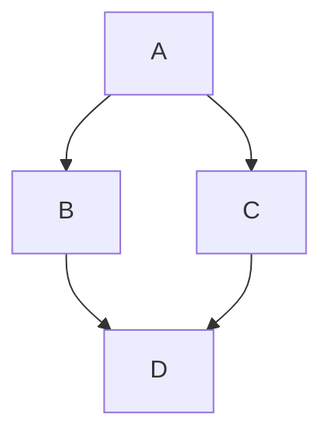

## 다이어그램(Mermaid)과 차트(Chart.js)를 추가해 보자

[이전글]({{ page.previous.url }})에서 `MathJax` 자바스크립트 라이브러리를 추가하여 수식을 블로그에 쓰는 법에 대해 알아보았다.

### 다이어그램

다이어그램은 `Mermaid` 라이브러리를 활용하면 된다.

* `_includes` 폴더에 `mermaid-support.html` 생성 후 스크립트 추가한다.

```javascript
<script src="https://cdnjs.cloudflare.com/ajax/libs/mermaid/8.0.0/mermaid.min.js"></script>
<script>
var config = {
    startOnLoad:true,
    theme: 'forest',
    flowchart:{
            useMaxWidth:false,
            htmlLabels:true
        }
};
mermaid.initialize(config);
mermaid.init(undefined, document.querySelectorAll('.language-mermaid'));
</script>
```

* `_layout/default.html` 파일의 `<head>` 부분 수정

```ruby
{ % if page.mermaid % }
    { % include mermaid-support.html % }
{ % endif % }
```

참고로 위의 내용에 `{`, `}` 과 `%` 사이의 빈칸은 없애야 함.

* 작성할 글의 YFM (Yaml front matter) 수정: `mermaid: true`
* `코드블럭` 내에 Mermaid 문법에 맞게 작성

입력 예 [Mermaid Flowchart](https://mermaid-js.github.io/mermaid/#/)
~~~

~~~
출력 예


### 차트

차트 관련 자바스크립트 라이브러리는 여러 가지가 있는데, 여기서는 `Chart.js`를 사용한다.

* `_includes` 폴더에 `chartjs-support.html` 생성 후 스크립트 추가한다.

```javascript
<script src="https://cdn.jsdelivr.net/npm/chart.js"></script>
```

* `_layout/default.html` 파일의 `<head>` 부분 수정

```ruby
{ % if page.chart % }
    { % include chartjs-support.html % }
{ % endif % }
```

참고로 위의 내용에 `{`, `}` 과 `%` 사이의 빈칸은 없애야 함.

* 작성할 글의 YFM (Yaml front matter) 수정: `chart: true`
* Chart.js 형식에 맞게 자바스크립트 작성

입력 예 [Chart.js Getting Started](https://www.chartjs.org/docs/latest/)

```html
<div style="width:100%">
    <canvas id="myChart" height="300"></canvas>
</div>
<script>
const ctx = document.getElementById('myChart').getContext('2d');
const myChart = new Chart(ctx, {
    type: 'bar',
    data: {
        labels: ['Red', 'Blue', 'Yellow', 'Green', 'Purple', 'Orange'],
        datasets: [{
            label: '# of Votes',
            data: [12, 19, 3, 5, 2, 3],
            backgroundColor: [
                'rgba(255, 99, 132, 0.2)',
                'rgba(54, 162, 235, 0.2)',
                'rgba(255, 206, 86, 0.2)',
                'rgba(75, 192, 192, 0.2)',
                'rgba(153, 102, 255, 0.2)',
                'rgba(255, 159, 64, 0.2)'
            ],
            borderColor: [
                'rgba(255, 99, 132, 1)',
                'rgba(54, 162, 235, 1)',
                'rgba(255, 206, 86, 1)',
                'rgba(75, 192, 192, 1)',
                'rgba(153, 102, 255, 1)',
                'rgba(255, 159, 64, 1)'
            ],
            borderWidth: 1
        }]
    },
    options: {
        scales: {
            y: {
                beginAtZero: true
            }
        }
    }
});
</script>
```

출력 예

<div style="width:100%">
    <canvas id="myChart" height="300"></canvas>
</div>
<script>
const ctx = document.getElementById('myChart').getContext('2d');
const myChart = new Chart(ctx, {
    type: 'bar',
    data: {
        labels: ['Red', 'Blue', 'Yellow', 'Green', 'Purple', 'Orange'],
        datasets: [{
            label: '# of Votes',
            data: [12, 19, 3, 5, 2, 3],
            backgroundColor: [
                'rgba(255, 99, 132, 0.2)',
                'rgba(54, 162, 235, 0.2)',
                'rgba(255, 206, 86, 0.2)',
                'rgba(75, 192, 192, 0.2)',
                'rgba(153, 102, 255, 0.2)',
                'rgba(255, 159, 64, 0.2)'
            ],
            borderColor: [
                'rgba(255, 99, 132, 1)',
                'rgba(54, 162, 235, 1)',
                'rgba(255, 206, 86, 1)',
                'rgba(75, 192, 192, 1)',
                'rgba(153, 102, 255, 1)',
                'rgba(255, 159, 64, 1)'
            ],
            borderWidth: 1
        }]
    },
    options: {
        scales: {
            y: {
                beginAtZero: true
            }
        }
    }
});
</script>
